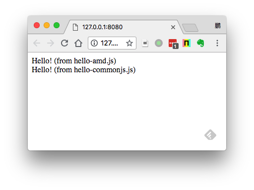

JavaScript JSPM Demo
====================

Jspm是构建于SystemJS之上的一套前端包管理系统。

首先在全局安装`jspm`：

```
npm install
npm run jspm-install
```



开发与打包
-----

默认情况下，本地各JS文件不会被打包，JavaScript文件的转换（ES6->ES5）也是在浏览器端完成。

如果需要在打包，可以执行：

```
npx jspm bundle index --inject
```

其中`index`指的是入口文件`index.js`，`--inject`是说将该bundle信息加入到`config.js`中。

执行完以后，它会生成`build.js`文件，同时向`config.js`增加这段：

```
bundles: {
  "build.js": [
    "index.js",
    "src/hello-es6.js",
    "npm:jquery@3.3.1.js",
    "npm:jquery@3.3.1/dist/jquery.js",
    "src/hello-commonjs.js",
    "src/hello-amd.js"
  ]
}
```

这样，当前端的`index.html`读取到这一段时，就会只下载`build.js`，而不会下载`build.js`里所包含的其它文件了。

与Webpack比较
------------

与Webpack喜欢在server端将依赖打包成一个文件的风格不同的是，Jspm倾向于：

- 在开发阶段，它的各项操作都是在前端完成的（比如将es6转换成普通js代码也是通过浏览器端的babel实现的）
- 文件不打包，而是在前端由SystemJS下载各JS文件并管理依赖
- 尽量使用CDN的速度优势，实际上jspm本身也提供了一个CDN: <https://jspm.io/>

当然在发布时，Jspm还是可以在server端将所有文件转换并打包成一个文件的。

然而相比Webpack，Webpack的优势并不大：

- webpack使用和配置都很方便，编译速度也很快
- webpack可以通过`webpack-cdn-plugin`插件，不打包依赖，同时使用相应的CDN
- webpack的生态非常繁荣

同时还有一定的劣势：

- 我们在不可避免的使用`npm`的同时，还需要使用`jspm`，掌握两套模块依赖管理的配置。

所以我觉得还是尽可能的使用Webpack + npm这一套解决方案就够了。

Resources
---------

- JSPM ES6 Demo: <https://github.com/jspm/demo-es6>