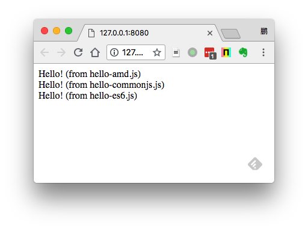

JavaScript JSPM Demo
====================

Jspm是构建于SystemJS之上的一套前端包管理系统。

与Webpack喜欢在server端将依赖打包成一个文件的风格不同的是，Jspm倾向于：

- 在开发阶段，它的各项操作都是在前端完成的（比如将es6转换成普通js代码也是通过浏览器端的babel实现的）
- 文件不打包，而是在前端由SystemJS下载各JS文件并管理依赖
- 尽量使用CDN的速度优势，实际上jspm本身也提供了一个CDN: <https://jspm.io/>

当然在发布时，Jspm还是可以在server端将所有文件转换并打包成一个文件的。

然而相比Webpack，Webpack的优势并不大：

- webpack使用和配置都很方便，编译速度也很快
- webpack可以通过`webpack-cdn-plugin`插件，不打包依赖，同时使用相应的CDN
- webpack的生态非常繁荣

同时还有一定的劣势：

- 我们在不可避免的使用`npm`的同时，还需要使用`jspm`，掌握两套模块依赖管理的配置。

所以我觉得还是尽可能的使用Webpack + npm这一套解决方案就够了。

Resources
---------

- JSPM ES6 Demo: <https://github.com/jspm/demo-es6>